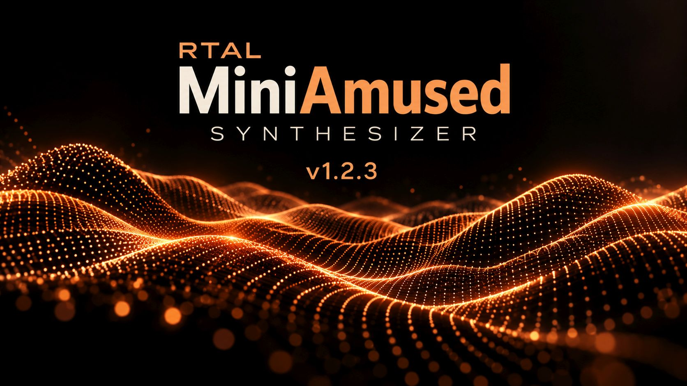
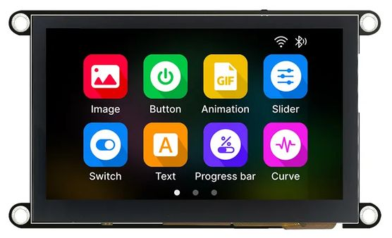
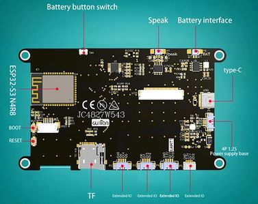
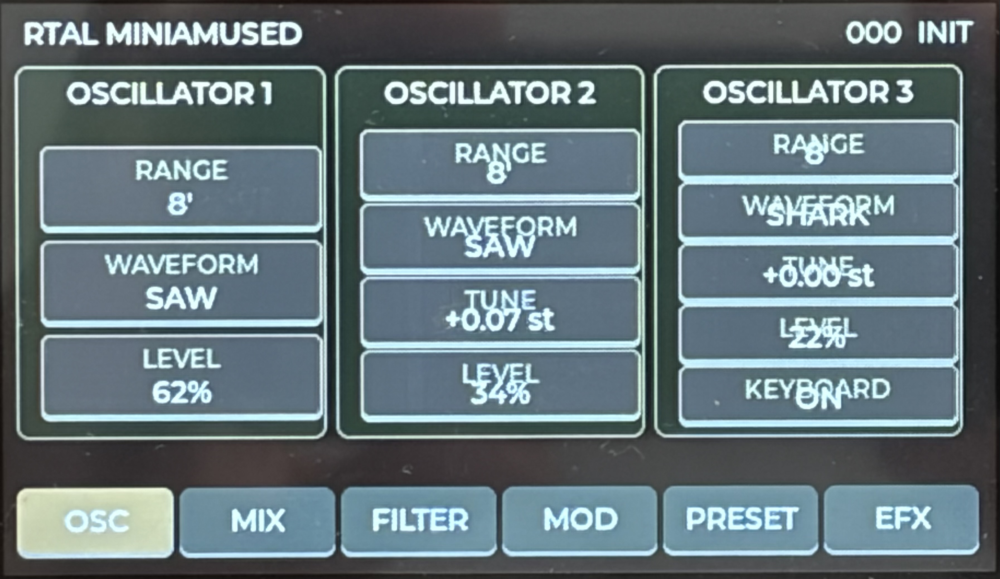
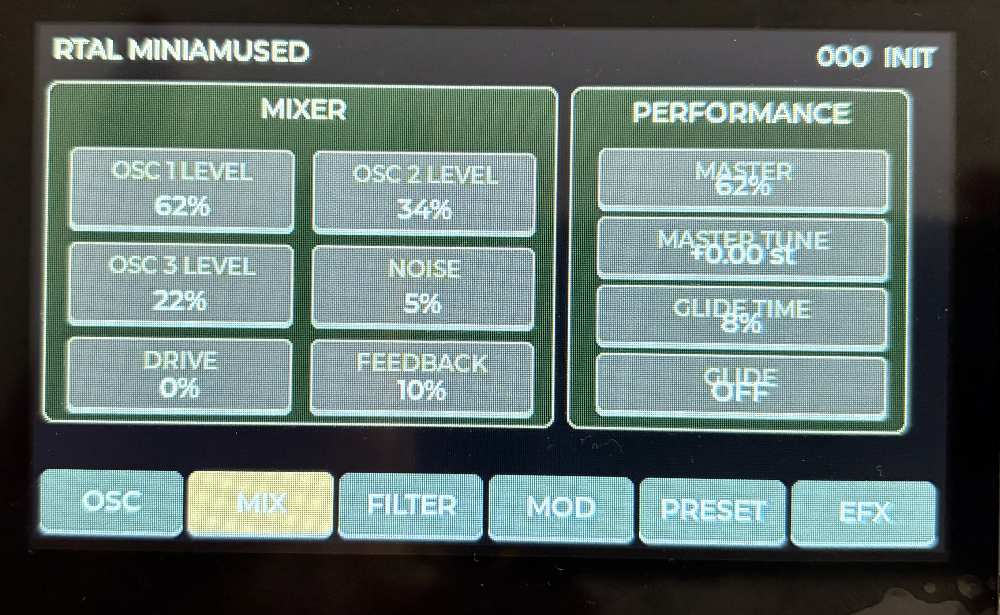
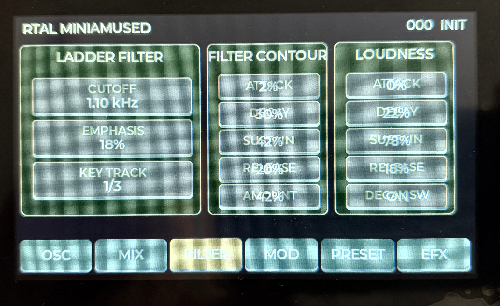
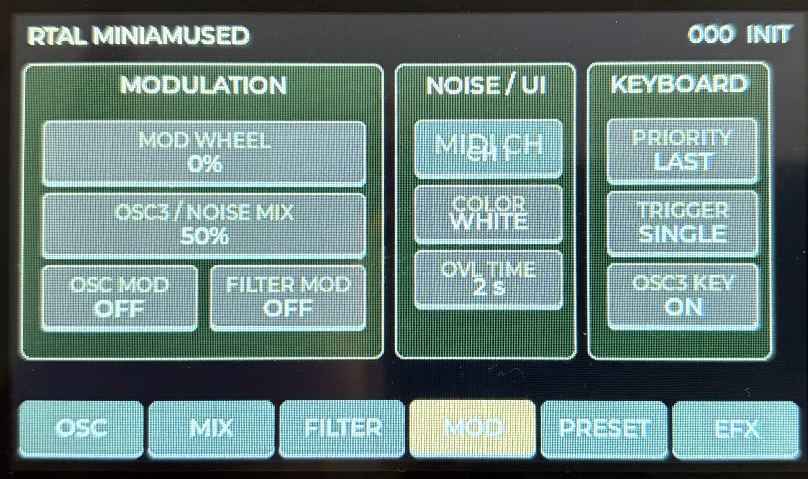
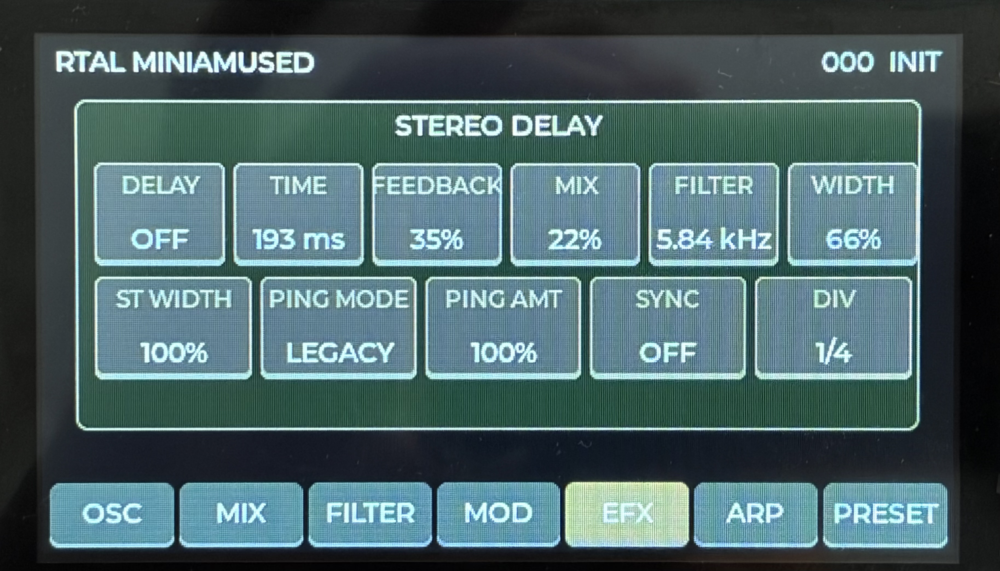
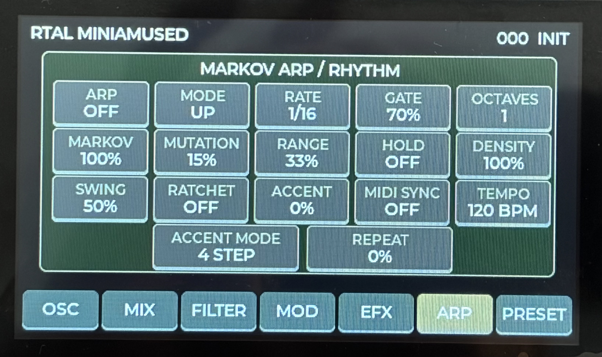
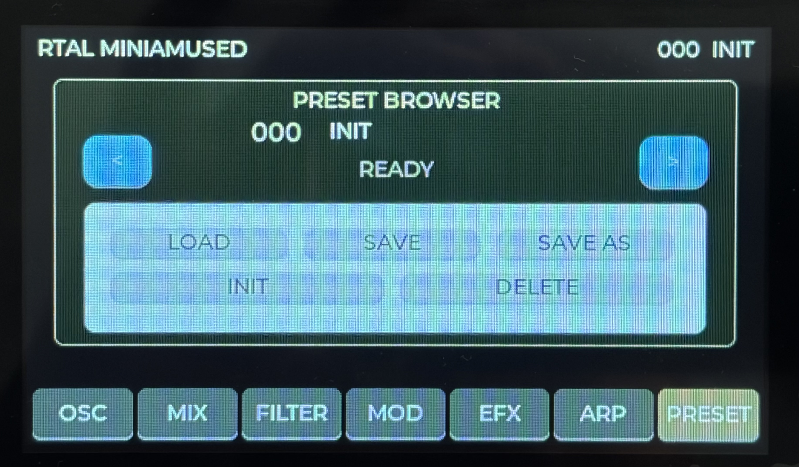

# RTAL-EAI-011 MiniAmused Synthesizer

### Version 1.2.3 · Monophonic Virtual-Analog Synthesizer · Markov Chain Arpeggiator · ESP32-S3 · 4.3" Touch UI · MIDI · Real-Time DSP



**RTAL MiniAmused** is a monophonic virtual-analog synthesizer developed
by **RealTimeAudioLab (RTAL)** as part of the **RTAL Embedded Audio
Initiative (EAI)**.

MiniAmused explores how the architecture, immediacy and
performance-oriented workflow of a classic monophonic analog synthesizer
can be reinterpreted and extended using modern embedded hardware.

At the heart of the instrument is an **ESP32-S3** running the real-time
synthesis engine, MIDI processing, graphical user interface and the
dedicated arpeggiator engine. The complete instrument is controlled from
a **4.3-inch capacitive touchscreen** using the **Guition JC4827W543
ESP32-S3 display platform**.

Version **1.2.3** significantly expands the original instrument with a
dedicated **Markov Chain Arpeggiator**, rhythmic performance controls,
internal and external clock operation, 128 preset positions, MIDI
mapping/learning, an optimized seven-page touchscreen workflow and a
dedicated startup screen.

MiniAmused combines:

-   monophonic virtual-analog synthesis
-   three oscillators forming one synthesizer voice
-   real-time subtractive synthesis
-   analog-inspired ladder-filter processing
-   filter and loudness envelopes
-   modulation and glide
-   a dedicated **Markov Chain Arpeggiator**
-   classic UP / DOWN / UP-DOWN / RANDOM arpeggiator modes
-   probabilistic MARKOV note movement
-   density, swing, ratchet, accent and repeat processing
-   internal tempo and external MIDI Clock synchronization
-   seven dedicated touchscreen pages
-   **LVGL 8.4.0** graphical user interface
-   **GT911** capacitive touch
-   DIN MIDI
-   native USB MIDI
-   MIDI mapping and MIDI Learn
-   continuous MIDI Clock synchronization
-   128 preset positions
-   SD-card storage
-   a dedicated **stereo delay**
-   external I2S audio conversion
-   optimized ESP32-S3 real-time DSP

> **The goal is not to create a software clone. The goal is to create a
> real embedded musical instrument.**

------------------------------------------------------------------------

# Version 1.2.3

Version 1.2.3 represents a major development step for MiniAmused.

The original monophonic virtual-analog architecture remains at the
center of the instrument, but the performance layer has been expanded
substantially.

The most important addition is the **ARP page** and its dedicated
real-time arpeggiator engine.

``` text
PLAYED CHORD
     │
     ▼
 HELD NOTE POOL
     │
     ▼
ARP / MARKOV ENGINE
     │
     ├── NOTE SELECTION
     ├── OCTAVE
     ├── DENSITY
     ├── SWING
     ├── RATCHET
     ├── ACCENT
     └── REPEAT
     │
     ▼
MONOPHONIC SYNTH ENGINE
     │
     ▼
 AUDIO OUTPUT
```

The instrument therefore remains **monophonic**, while a polyphonic MIDI
chord can act as source material for a dynamically generated monophonic
performance line.

## v1.2.3 highlights

-   dedicated seventh **ARP** touchscreen page
-   Markov Chain note-selection mode
-   UP / DOWN / UP-DOWN / RANDOM / MARKOV modes
-   RATE and GATE
-   octave expansion
-   MARKOV probability
-   MUTATION
-   RANGE
-   HOLD with corrected latch/release behaviour
-   DENSITY
-   SWING
-   RATCHET
-   ACCENT
-   ACCENT MODE
-   REPEAT
-   selectable internal clock or MIDI Clock synchronization
-   internal tempo range **40--300 BPM**
-   dedicated ARP task separated from the graphical UI
-   128 preset positions
-   MIDI mapping / MIDI Learn architecture
-   improved preset browser layout
-   dedicated MiniAmused startup image
-   optimized RGB565 QSPI display transfer path
-   preserved LVGL 8.4.0 platform
-   stable FINAL1 startup-page initialization

------------------------------------------------------------------------

# The Idea

The fundamental question behind MiniAmused was:

> **How much of the experience of a classic monophonic performance
> synthesizer can be recreated and extended using a modern ESP32-S3
> embedded platform?**

Traditional analog synthesizers achieve much of their immediacy through
a physical front panel: one function, one control, immediate
interaction.

MiniAmused translates this philosophy into a modern touchscreen
instrument. Instead of deeply nested menus, the synthesizer is divided
into dedicated functional pages representing the individual sections of
the instrument.

``` text
OSCILLATORS
     │
     ▼
   MIXER
     │
     ▼
   FILTER
     │
     ▼
 AMPLIFIER
     │
     ▼
STEREO DELAY
     │
     ▼
STEREO OUTPUT

MIDI / ARP / MODULATION / PRESETS
             │
             └────► interact with the signal path
```

The addition of the Markov arpeggiator extends this concept beyond sound
generation. MiniAmused can now transform a held chord into a controlled,
evolving monophonic sequence without becoming a conventional random-note
generator.

------------------------------------------------------------------------

# Inspired by the Minimoog

MiniAmused is strongly inspired by one of the most influential
electronic musical instruments ever created: the **Moog Minimoog**.

The Minimoog demonstrated how the flexibility of modular synthesis could
be transformed into a compact, immediate and highly expressive musical
instrument. Its basic architecture remains remarkably clear:

``` text
OSCILLATORS → MIXER → FILTER → AMPLIFIER
```

That philosophy is an important inspiration for MiniAmused.

MiniAmused is not intended to reproduce the original instrument circuit
by circuit. Instead, it asks what this fundamental concept might look
like when implemented using a modern microcontroller, real-time DSP,
touchscreen control, digital preset storage, USB MIDI, MIDI Clock,
graphical parameter visualization, an integrated digital delay and a
probabilistic performance engine.

The result is an independent RTAL instrument with its own architecture
and development path.

------------------------------------------------------------------------

# A Word of Thanks

RealTimeAudioLab would like to express its respect and gratitude to
**Bob Moog**, the engineers involved in the development of the Minimoog,
and the generations of musicians who demonstrated what this instrument
architecture could become.

The Minimoog established ideas that remain relevant more than half a
century later: **a clear signal path, immediate controls, expressive
interaction and an instrument designed to be played rather than
programmed.**

Those principles are a major inspiration behind MiniAmused.

MiniAmused is an independent **RealTimeAudioLab** project and is not
affiliated with, sponsored by, or endorsed by Moog Music.

Moog and Minimoog are trademarks of their respective owners.

------------------------------------------------------------------------

# Hardware Platform

## Guition JC4827W543



The central hardware platform of MiniAmused is the **Guition
JC4827W543**.

This compact module combines an ESP32-S3 microcontroller with a 4.3-inch
touchscreen, making it particularly interesting for standalone embedded
musical instruments.

  Component          MiniAmused Platform
  ------------------ ----------------------------------
  Processor          ESP32-S3
  CPU architecture   Dual-core Xtensa LX7
  CPU clock          up to 240 MHz
  Display            4.3-inch TFT
  Resolution         480 × 272
  Touch              Capacitive
  Touch controller   GT911
  External RAM       PSRAM
  Storage            Flash + microSD
  GUI                **LVGL 8.4.0**
  MIDI               DIN + Native USB MIDI
  Audio interface    External I2S
  Application        Real-time monophonic synthesizer

The display is not simply a status panel.

> **It is the front panel of MiniAmused.**

## JC4827W543 --- Rear View



The JC4827W543 provides the processing and peripheral interfaces
required for display rendering, capacitive touch, SD-card access, MIDI
communication, USB MIDI, external audio hardware and system control.

------------------------------------------------------------------------

# Why ESP32-S3?

MiniAmused deliberately uses the ESP32-S3 as a real-time musical
instrument processor.

The platform provides a useful combination of dual CPU cores, up to 240
MHz clock frequency, floating-point processing, DSP/vector capabilities,
DMA, I2S, SPI, I²C, UART, native USB and external PSRAM support.

The challenge is not simply generating a waveform. MiniAmused
simultaneously handles:

``` text
Real-Time Audio DSP
        +
MIDI DIN
        +
Native USB MIDI
        +
MIDI Clock
        +
ARP / Markov Processing
        +
Touch Processing
        +
LVGL 8.4.0 Graphics
        +
Preset Management
        +
SD Card
        +
Stereo Delay
        +
System Control
```

All of these systems must coexist without compromising the audio stream.

------------------------------------------------------------------------

# Monophonic Voice Architecture

MiniAmused is deliberately designed as a **monophonic synthesizer**.

The available processing resources are concentrated on a single complete
synthesis voice rather than being divided among several independent
voices. Multiple oscillators form part of this **one voice**.

``` text
                 MIDI NOTE
                     │
                     ▼
              NOTE PROCESSING
                     │
                     ▼
          ┌────────────────────┐
          │     OSCILLATORS    │
          │       OSC 1        │
          │       OSC 2        │
          │       OSC 3        │
          └─────────┬──────────┘
                    │
                    ▼
                  MIXER
                    │
                    ▼
                  FILTER
                    │
                    ▼
                AMPLIFIER
                    │
                    ▼
              STEREO DELAY
                    │
                    ▼
              AUDIO OUTPUT
```

> **Multiple oscillators do not mean multiple voices.**

When the arpeggiator is enabled, multiple held MIDI notes are stored as
source material, but the ARP engine still drives the same single
MiniAmused synthesis voice one generated note at a time.

This architecture is particularly suited to basses, leads, sequences,
arpeggiated lines, effects and experimental sounds.

------------------------------------------------------------------------

# Touchscreen User Interface

MiniAmused v1.2.3 uses a page-oriented touchscreen interface built with
**LVGL 8.4.0**.

The instrument now has exactly **seven permanent pages**:

``` text
OSC | MIX | FILTER | MOD | EFX | ARP | PRESET
```

There are **no separate AMP, ENV or LFO pages**. Their relevant controls
are integrated into the functional pages of the instrument.

The ARP page is positioned directly between **EFX** and **PRESET**,
keeping synthesis, effects, performance and storage functions in a
logical left-to-right workflow.

------------------------------------------------------------------------

# OSC --- Oscillators



The **OSC** page defines the raw sound of the monophonic voice.
MiniAmused uses three oscillators. They are not separate voices: all
three feed the same mixer, filter and amplifier path.

## OSC parameters

  -----------------------------------------------------------------------
  Parameter                           Function
  ----------------------------------- -----------------------------------
  **OSC 1 WAVE**                      Selects the waveform generated by
                                      oscillator 1.

  **OSC 1 RANGE**                     Selects the octave/register of
                                      oscillator 1.

  **OSC 2 WAVE**                      Selects the waveform generated by
                                      oscillator 2.

  **OSC 2 RANGE**                     Selects the octave/register of
                                      oscillator 2.

  **OSC 2 TUNE**                      Detunes oscillator 2 relative to
                                      the played note and oscillator 1.

  **OSC 3 WAVE**                      Selects the waveform generated by
                                      oscillator 3.

  **OSC 3 RANGE**                     Selects the octave/register of
                                      oscillator 3.

  **OSC 3 TUNE**                      Detunes oscillator 3 relative to
                                      the main pitch.

  **OSC 3 KEYBOARD CONTROL**          Determines whether oscillator 3
                                      follows the played keyboard note.
  -----------------------------------------------------------------------

The three-oscillator architecture follows the classic
performance-synthesizer idea: several tone generators interact inside
one monophonic signal path.

------------------------------------------------------------------------

# MIX --- Mixer and Signal Character



The **MIX** page determines how strongly the individual sound sources
enter the following filter stage and contains parameters that influence
the character of the combined signal.

  -----------------------------------------------------------------------
  Parameter                           Function
  ----------------------------------- -----------------------------------
  **OSC 1 LEVEL**                     Sets oscillator 1 contribution.

  **OSC 2 LEVEL**                     Sets oscillator 2 contribution.

  **OSC 3 LEVEL**                     Sets oscillator 3 contribution.

  **NOISE LEVEL**                     Adds broadband noise to the
                                      oscillator mix.

  **NOISE COLOR**                     Changes the tonal character of the
                                      noise source.

  **MIXER DRIVE**                     Controls how strongly the combined
                                      signal drives the nonlinear path.

  **FEEDBACK LEVEL**                  Feeds a controlled part of the
                                      synthesizer signal back into the
                                      signal path.

  **MASTER VOLUME**                   Controls overall synthesizer output
                                      level.
  -----------------------------------------------------------------------

------------------------------------------------------------------------

# FILTER --- Ladder Filter and Filter Envelope



The **FILTER** page contains the main subtractive sound-shaping stage
and its dedicated ADSR envelope.

  -----------------------------------------------------------------------
  Parameter                           Function
  ----------------------------------- -----------------------------------
  **FILTER CUTOFF**                   Sets the low-pass cutoff frequency.

  **FILTER RESONANCE**                Emphasizes frequencies around the
                                      cutoff point.

  **FILTER CONTOUR**                  Sets the filter-envelope modulation
                                      amount.

  **FILTER KEYTRACK**                 Makes cutoff follow the played
                                      note.

  **FILTER ATTACK**                   Filter-envelope attack time.

  **FILTER DECAY**                    Filter-envelope decay time.

  **FILTER SUSTAIN**                  Filter-envelope sustain level.

  **FILTER RELEASE**                  Filter-envelope release time.
  -----------------------------------------------------------------------

------------------------------------------------------------------------

# MOD --- Performance, Modulation and Loudness



The **MOD** page collects performance controls, modulation routing and
the amplitude contour.

  -----------------------------------------------------------------------
  Parameter                           Function
  ----------------------------------- -----------------------------------
  **MOD WHEEL**                       Current modulation-wheel amount.

  **MOD MIX**                         Determines the relationship of
                                      modulation sources.

  **OSC MOD**                         Enables oscillator pitch
                                      modulation.

  **FILTER MOD**                      Enables filter-cutoff modulation.

  **GLIDE**                           Enables portamento.

  **GLIDE TIME**                      Sets pitch-transition time.

  **NOTE PRIORITY**                   Selects monophonic note-priority
                                      behaviour.

  **DECAY**                           Enables the classic decay behaviour
                                      used by the envelope system.

  **LOUDNESS ATTACK**                 Amplifier-envelope attack.

  **LOUDNESS DECAY**                  Amplifier-envelope decay.

  **LOUDNESS SUSTAIN**                Amplifier-envelope sustain.

  **LOUDNESS RELEASE**                Amplifier-envelope release.
  -----------------------------------------------------------------------

------------------------------------------------------------------------

# EFX --- Stereo Delay



The **EFX** page contains exactly one effect: the MiniAmused **Stereo
Delay**. There is no chorus, flanger, phaser or reverb in the current
MiniAmused effect architecture.

  -----------------------------------------------------------------------
  Parameter                           Function
  ----------------------------------- -----------------------------------
  **DELAY**                           Enables or bypasses the delay.

  **TIME**                            Free-running delay time when SYNC
                                      is disabled.

  **FEEDBACK**                        Determines the number and
                                      persistence of repeats.

  **MIX**                             Dry/wet relationship.

  **FILTER**                          Low-pass filtering of the delayed
                                      signal.

  **WIDTH**                           Stereo spread of the delay output.

  **PING PONG**                       Continuously controls left/right
                                      ping-pong behaviour from 0--100%.

  **SYNC**                            Selects free operation or external
                                      MIDI Clock synchronization.

  **DIV**                             Rhythmic delay division when
                                      synchronized.
  -----------------------------------------------------------------------

## FREE mode

With **SYNC = OFF**, **TIME** directly controls the delay time.

``` text
SYNC OFF → TIME → DELAY TIME
```

## MIDI Clock synchronized delay

With **SYNC = ON**, the delay derives timing from continuously arriving
MIDI Clock.

MIDI Clock provides **24 F8 ticks per quarter note**. MiniAmused
evaluates the clock over complete windows rather than reacting directly
to every individual tick.

Available divisions include:

``` text
1/4
1/8
1/8D
1/8T
1/16
1/16D
1/16T
1/32
```

## Stable Delay-Time Engine

Changing delay time abruptly can produce clicks, discontinuities and
strong pitch artifacts.

MiniAmused therefore uses two fixed delay taps and a **24 ms crossfade**
during real timing changes:

``` text
OLD TAP ────────┐
                ├── 24 ms CROSSFADE ──► OUTPUT
NEW TAP ────────┘
```

The synchronized delay also uses stability checking, hysteresis and
**0.5 ms target-time quantization** so insignificant MIDI Clock jitter
does not constantly move the delay tap.

## FILTER

The delay path includes a low-pass filter. Lower settings progressively
darken the repeats and allow them to sit behind the dry synthesizer
signal.

## WIDTH and PING PONG

**WIDTH** and **PING PONG** are deliberately separate.

WIDTH controls overall stereo spread. PING PONG controls how strongly
successive delay energy alternates or spreads between the left and right
channels.

------------------------------------------------------------------------

# ARP --- Markov Chain Arpeggiator



The **ARP** page is the major performance addition in MiniAmused v1.2.3.

A conventional arpeggiator normally walks through held notes according
to a deterministic order such as UP or DOWN. A random arpeggiator
selects notes without memory.

MiniAmused adds a third concept: **Markov-based movement**.

Instead of treating every note as an unrelated random event, the Markov
engine decides the next movement relative to the current position.

``` text
                       ┌── SAME ──────┐
                       │              │
HELD CHORD → CURRENT NOTE ── +1 ─────┤
                       │      -1      │
                       │      +2      ├──► NEXT NOTE
                       │      -2      │
                       └── RANDOM ────┘
                              ▲
                              │
                    MARKOV / MUTATION
```

This creates patterns that can evolve while retaining a relationship to
their previous state.

## ARP modes

MiniAmused provides five note-selection modes:

  Mode          Behaviour
  ------------- -------------------------------------------------
  **UP**        Walks upward through held notes.
  **DOWN**      Walks downward through held notes.
  **UP-DOWN**   Alternates direction across the held-note pool.
  **RANDOM**    Selects notes randomly.
  **MARKOV**    Uses probabilistic state-dependent movement.

## ARP parameters

  -----------------------------------------------------------------------
  Parameter                           Function
  ----------------------------------- -----------------------------------
  **ARP**                             Enables or disables the
                                      arpeggiator.

  **MODE**                            UP, DOWN, UP-DOWN, RANDOM or
                                      MARKOV.

  **RATE**                            Selects the rhythmic step rate.

  **GATE**                            Sets generated note length relative
                                      to the step.

  **OCTAVES**                         Extends the generated pattern
                                      across additional octaves.

  **MARKOV**                          Controls the probability of using
                                      Markov movement instead of the
                                      deterministic path.

  **MUTATION**                        Introduces occasional random note
                                      selection into the evolving
                                      sequence.

  **RANGE**                           Influences the probability of wider
                                      ±2 movements versus smaller ±1
                                      movements.

  **HOLD**                            Latches released notes into the ARP
                                      note pool.

  **DENSITY**                         Controls how many rhythmic steps
                                      produce notes; omitted steps are
                                      true rests.

  **SWING**                           Alternates step timing to create a
                                      swung rhythmic feel.

  **RATCHET**                         Adds repeated sub-triggers inside
                                      an active step.

  **ACCENT**                          Controls velocity emphasis on
                                      selected accent steps.

  **ACCENT MODE**                     Selects 4 STEP, 3 STEP, 2 STEP,
                                      RANDOM or MARKOV accent behaviour.

  **REPEAT**                          Adds a probability that the
                                      previous selected chord position is
                                      repeated.

  **MIDI SYNC**                       Selects external MIDI Clock or
                                      internal tempo operation.

  **TEMPO**                           Internal tempo from **40--300 BPM**
                                      when MIDI SYNC is disabled.
  -----------------------------------------------------------------------

------------------------------------------------------------------------

# Understanding MARKOV

The **MARKOV** parameter is not simply a randomness amount.

At low values, the arpeggiator behaves more like the deterministic
note-order logic. As MARKOV is increased, state-dependent movement
increasingly determines the next note.

The movement states are conceptually:

``` text
SAME
 +1
 -1
 +2
 -2
RANDOM
```

The current note position therefore influences what can happen next.

This is the important difference from a simple RANDOM mode:

``` text
RANDOM:
each next note can be independent

MARKOV:
current state → transition probability → next state
```

The result can feel more like an evolving musical process than an
arbitrary stream of notes.

------------------------------------------------------------------------

# MUTATION and RANGE

**MUTATION** provides a controlled escape from the normal transition
behaviour.

A higher mutation value increases the chance that the engine chooses a
random note rather than following the normal movement decision.

**RANGE** influences the character of Markov movement by changing the
relationship between small and larger index movements.

Together, MARKOV, MUTATION and RANGE form the core of the generative
note-selection system.

``` text
MARKOV   → how strongly state-based movement is used
MUTATION → how often the normal process is deliberately broken
RANGE    → how local or wide the movement tends to be
```

------------------------------------------------------------------------

# HOLD

HOLD allows a chord to remain available to the ARP engine after keys are
released.

The v1.2.3 implementation distinguishes between **physically held keys**
and **latched ARP notes**.

Behaviour is therefore predictable:

``` text
HOLD OFF
    only physically held keys remain in the pool

HOLD ON
    released notes remain latched

HOLD ON → OFF
    released/latched notes are removed immediately
    physically held keys remain

ARP OFF
    generated output stops and the ARP pool is cleared
```

This makes HOLD useful for performance without leaving stale notes in
the note pool.

------------------------------------------------------------------------

# DENSITY

DENSITY controls whether an otherwise valid ARP step actually produces a
note.

A skipped density step is a **true rhythmic rest** rather than merely a
silent note-selection event.

This allows the arpeggiator to move from continuous classic patterns
toward sparse, syncopated and generative rhythms.

------------------------------------------------------------------------

# SWING

SWING alternates the timing relationship between successive ARP steps.

At the straight setting, steps remain evenly spaced. Increasing SWING
offsets alternating steps while keeping the overall rhythmic framework
intact.

------------------------------------------------------------------------

# RATCHET

RATCHET creates additional note triggers inside an active ARP step.

This can turn a simple sequence into faster repeated figures without
requiring the master ARP rate itself to be increased.

The ratchet system is implemented non-blockingly so the ARP task can
continue to service timing while audio processing remains independent.

------------------------------------------------------------------------

# ACCENT and ACCENT MODE

ACCENT increases velocity on selected rhythmic steps.

The **ACCENT MODE** determines where those accents occur:

``` text
4 STEP
3 STEP
2 STEP
RANDOM
MARKOV
```

The MARKOV accent mode gives the accent process a simple memory: the
probability of the next accent depends on whether the previous step was
accented.

This extends the generative concept from pitch into dynamics.

------------------------------------------------------------------------

# REPEAT

REPEAT introduces a probability that the previous chord position is
selected again before normal note-selection logic continues.

This creates local persistence and repeated-note gestures that would be
less likely in a purely directional arpeggio.

REPEAT is deliberately probabilistic rather than a fixed repeat count.

------------------------------------------------------------------------

# ARP Clocking

The arpeggiator can operate from two timing sources.

## Internal clock

With **MIDI SYNC = OFF**, MiniAmused generates its own ARP timing.

``` text
TEMPO: 40–300 BPM
```

The internal clock allows MiniAmused to operate as a self-contained
performance instrument without an external sequencer.

## External MIDI Clock

With **MIDI SYNC = ON**, ARP timing follows incoming MIDI Clock.

MiniAmused uses the standard MIDI real-time messages:

``` text
F8   MIDI CLOCK
FA   START
FB   CONTINUE
FC   STOP
```

The design assumes that **F8 clock may arrive continuously**, while
transport messages independently determine RUN/STOP state.

This is intentional and supports hardware sequencers that continue
sending clock while stopped.

## ARP rate divisions

The ARP engine uses musical clock divisions corresponding to its RATE
positions, including quarter-, eighth-, triplet- and sixteenth-note
relationships.

The timing engine is independent from the graphical UI.

------------------------------------------------------------------------

# Dedicated ARP Task

A central v1.2.3 architectural change is that the arpeggiator does
**not** run from the touchscreen service loop.

Earlier development showed that graphical interaction and LVGL rendering
can temporarily require significant processing time. ARP timing must not
depend on how much of the display is being redrawn.

The final architecture therefore separates the ARP scheduler:

``` text
CORE 0
 ├── ARP Task      high control priority
 └── MIDI Task

CORE 1
 ├── Audio Task    highest real-time priority
 └── Arduino/UI loop
```

The ARP service runs independently at a short control interval, while
audio processing retains the highest real-time priority.

This separation is fundamental to stable arpeggiator timing.

------------------------------------------------------------------------

# PRESET --- Preset Management



MiniAmused v1.2.3 provides **128 preset positions** on the microSD card.

The preset page was refined for the final release to improve readability
and touch operation.

The browser presents the selected slot and preset name together, with
the status directly below. The navigation arrows are compact so more
vertical space is available for the main preset actions.

## PRESET functions

  -----------------------------------------------------------------------
  Control / Function                  Description
  ----------------------------------- -----------------------------------
  **Preset Browser**                  Browses the 128 available preset
                                      slots.

  **000--127**                        Complete preset range.

  **LOAD**                            Loads the selected preset.

  **SAVE**                            Saves the current sound to its
                                      current slot.

  **SAVE AS**                         Stores the sound in another slot
                                      and supports naming.

  **INIT**                            Restores the initialized
                                      synthesizer state.

  **DELETE**                          Deletes the selected stored preset.

  **Preset Name**                     Human-readable preset name.

  **Empty Slot Detection**            Distinguishes unused positions from
                                      stored presets.

  **Program Change**                  Allows MIDI Program Change based
                                      preset selection.

  **Header Preset Name**              Shows the currently active preset
                                      in the instrument UI.
  -----------------------------------------------------------------------

Preset loading is deliberately deferred out of time-critical MIDI
processing so SD-card access does not interfere with audio or MIDI
timing.

------------------------------------------------------------------------

# MIDI

MiniAmused was designed as a MIDI instrument from the beginning.

Two MIDI interfaces operate in parallel:

``` text
             ┌──── DIN MIDI
             │
MIDI ENGINE ◄┤
             │
             └──── Native USB MIDI
```

Traditional DIN MIDI allows MiniAmused to communicate with keyboards,
hardware sequencers and controllers. Native USB MIDI provides direct
communication with compatible computer systems.

------------------------------------------------------------------------

# MIDI Channel and Note Processing

MIDI note input is integrated with the monophonic note-priority system
when ARP is disabled.

With ARP enabled, incoming held notes become the source pool for the ARP
engine, and only the generated ARP note is passed into the monophonic
synthesis path.

This preserves the fundamental one-voice architecture while allowing
chords to control the performance generator.

------------------------------------------------------------------------

# MIDI Mapping and MIDI Learn

The v1.2.x generation extends MiniAmused with a MIDI mapping and
learning architecture.

This allows hardware controllers to be associated with synthesizer
parameters without hard-coding every performance setup into the
instrument UI.

MiniAmused retains its established MIDI mapping behaviour, including the
existing **CC32 bank-based mapping concept**, while the learning system
provides a more practical workflow for assigning controls.

The MIDI mapping system is kept separate from the time-critical audio
path.

------------------------------------------------------------------------

# MIDI Clock

MiniAmused uses MIDI Clock for more than one subsystem in v1.2.3.

``` text
                 MIDI F8 CLOCK
                      │
          ┌───────────┴───────────┐
          ▼                       ▼
     ARP CLOCKING             DELAY SYNC
          │                       │
          ▼                       ▼
   RHYTHMIC NOTES          RHYTHMIC ECHOES
```

F8 may remain continuously present.

Transport is handled separately:

``` text
FA → START
FB → CONTINUE
FC → STOP
```

This architecture matches setups in which a master sequencer provides
continuous timing while transport state changes independently.

------------------------------------------------------------------------

# Real-Time DSP

The most important rule of the MiniAmused software architecture remains:

> **Audio has priority.**

An embedded synthesizer cannot temporarily stop processing audio because
the display needs to redraw a control, an SD card is being accessed or
an arpeggiator is calculating its next note.

The system therefore separates time-critical DSP from lower-priority
work.

``` text
HIGHEST REAL-TIME PRIORITY

    AUDIO DSP
       │
       ▼
    I2S OUTPUT


CONTROL / COMMUNICATION

    ARP
    MIDI DIN
    USB MIDI
    MIDI CLOCK


USER / STORAGE

    TOUCH
    LVGL 8.4.0
    DISPLAY
    PRESETS
    SD CARD
```

------------------------------------------------------------------------

# LVGL 8.4.0 Graphical Interface

The complete MiniAmused graphical user interface remains based on **LVGL
8.4.0**.

LVGL provides synthesis pages, sliders, buttons, labels, overlays,
dynamic elements and touch interaction.

The GUI is designed specifically around the JC4827W543's **480 × 272**
display.

> **The touchscreen is the front panel of the instrument.**

## Why LVGL 8.4.0 instead of LVGL 9?

MiniAmused deliberately remains on **LVGL 8.4.0**.

This is a conscious engineering decision. The MiniAmused user interface
was developed and validated around the LVGL 8.4.0 API together with the
Guition JC4827W543, its 480 × 272 display and GT911 touch controller.

For a real-time musical instrument, a newer major library version is not
automatically a better platform. Stability, known behaviour and a
thoroughly tested hardware/software combination are more important than
changing a proven subsystem solely because a newer API exists.

> **Do not replace a proven real-time subsystem without a concrete
> technical reason.**

Moving MiniAmused to LVGL 9 would be a GUI-platform migration rather
than a simple library update.

For the v1.2.3 generation, **LVGL 8.4.0 is therefore the intentionally
selected and validated graphical platform**.

------------------------------------------------------------------------

# Display Architecture

The v1.2.3 display path uses a partial LVGL draw buffer in internal
DMA-capable memory.

The final display implementation retains the tested direct RGB565 QSPI
transfer path.

Conceptually:

``` text
LVGL 8.4.0
     │
     ▼
INTERNAL RGB565 DRAW BUFFER
     │
     ▼
DIRECT QSPI TRANSFER
     │
     ▼
NV3041A DISPLAY
     │
     ▼
480 × 272 TFT
```

The display subsystem remains deliberately separated from the audio
engine.

------------------------------------------------------------------------

# Startup Screen


Version 1.2.3 introduces a dedicated MiniAmused startup screen.

The image is prepared for the native **480 × 272** display and stored as
RGB565 data in firmware Flash.

The startup image identifies:

``` text
RTAL
MiniAmused
SYNTHESIZER
v1.2.3
```

After the startup image, the normal MiniAmused interface is initialized
with a defined active-page state.

------------------------------------------------------------------------

# GT911 Capacitive Touch

The touchscreen uses a **GT911 capacitive touch controller**.

MiniAmused translates GT911 touch events into LVGL 8.4.0 input events:

``` text
FINGER
  │
  ▼
GT911
  │
  ▼
TOUCH DRIVER
  │
  ▼
LVGL 8.4.0
  │
  ▼
PARAMETER SYSTEM
  │
  ▼
SYNTH / ARP / PRESET CONTROL
```

------------------------------------------------------------------------

# SD Card Storage

The SD card provides persistent storage outside the firmware image.

In MiniAmused v1.2.3 its central role is persistent preset storage.
Keeping preset data separate from firmware allows the instrument
firmware to evolve without embedding the complete sound library in the
application image.

------------------------------------------------------------------------

# External I2S Audio

MiniAmused uses an external digital audio path.

``` text
MiniAmused DSP
      │
      ▼
     I2S
      │
      ├── BCLK
      ├── LRCK
      └── DATA
      │
      ▼
 External DAC
      │
      ▼
 Analog Audio
      │
      ▼
   OUTPUT
```

------------------------------------------------------------------------

# Software Architecture

``` text
┌──────────────────────────────────────────┐
│            MiniAmused v1.2.3            │
├──────────────────────────────────────────┤
│               Synth Engine               │
│ Oscillators → Mixer → Filter → Amplifier │
│                    │                     │
│              Stereo Delay                │
│                    │                     │
│                I2S Audio                 │
├──────────────────────────────────────────┤
│ ARP / MARKOV │ MIDI DIN │ USB MIDI       │
│ MIDI CLOCK   │ Transport │ MIDI Learn    │
├──────────────────────────────────────────┤
│ Presets │ SD │ Parameter System          │
├──────────────────────────────────────────┤
│ Touch │ GT911 │ LVGL 8.4.0 │ TFT         │
└──────────────────────────────────────────┘
```

------------------------------------------------------------------------

# Real-Time Task Architecture

The final v1.2.3 architecture separates major timing domains.

``` text
ESP32-S3

CORE 0
 ├── ARP TASK
 │    ├── note scheduling
 │    ├── Markov selection
 │    ├── density
 │    ├── swing
 │    ├── ratchet
 │    └── accent
 │
 └── MIDI TASK
      ├── DIN MIDI
      ├── USB MIDI
      ├── F8 Clock
      └── Transport

CORE 1
 ├── AUDIO TASK
 │    ├── oscillators
 │    ├── mixer
 │    ├── filter
 │    ├── envelopes
 │    ├── delay
 │    └── I2S
 │
 └── UI / SYSTEM
      ├── LVGL
      ├── GT911
      ├── preset management
      └── SD
```

The exact objective is not maximum benchmark performance.

The objective is **predictable musical behaviour with uninterrupted
audio**.

------------------------------------------------------------------------

# Development Philosophy

MiniAmused is developed directly on physical hardware.

New functionality is introduced incrementally and tested as part of the
complete instrument.

Particular attention is paid to:

-   sound quality
-   audio stability
-   DSP execution time
-   filter and oscillator behaviour
-   MIDI reliability
-   MIDI Clock synchronization
-   ARP timing
-   Markov behaviour
-   HOLD behaviour
-   delay stability
-   USB MIDI
-   touchscreen responsiveness
-   GUI behaviour
-   preset reliability
-   SD-card behaviour
-   heap/PSRAM usage
-   long-term stability

The project is not simply a DSP experiment.

It is an attempt to create a **complete standalone embedded
synthesizer**.

------------------------------------------------------------------------

# Software Baseline

MiniAmused v1.2.3 is built around the proven RTAL software baseline used
for the final instrument.

Key components include:

``` text
Arduino IDE 2.x
ESP32-S3
LVGL 8.4.0
Arduino_GFX
GT911 Touch
Native USB MIDI
DIN MIDI
microSD
External I2S Audio
```

For the final MiniAmused generation, stability of the validated
combination takes priority over unnecessary major-library migration.

------------------------------------------------------------------------

# Project Status

**RTAL-EAI-011 MiniAmused v1.2.3 is a release-level instrument build.**

The v1.2.3 development line combines:

**Sound Engine + DSP + MIDI + Markov ARP + Touch UI + Presets + Stereo
Delay + Hardware**

The final release basis was frozen only after functional testing of the
synthesis engine, MIDI paths, ARP, HOLD behaviour, clocking, presets,
display startup state and final user-interface changes.

------------------------------------------------------------------------

# From v1.0 to v1.2.3

The original v1.0 concept established the complete standalone MiniAmused
synthesizer:

``` text
MONOPHONIC VA SYNTH
+
TOUCH UI
+
DIN / USB MIDI
+
PRESETS
+
STEREO DELAY
```

v1.2.3 extends that foundation:

``` text
v1.0 FOUNDATION
      │
      ▼
MARKOV ARPEGGIATOR
      +
RHYTHM ENGINE
      +
INTERNAL / MIDI CLOCK
      +
128 PRESETS
      +
MIDI LEARN
      +
7-PAGE UI
      +
FINAL DISPLAY / STARTUP WORKFLOW
      │
      ▼
MiniAmused v1.2.3
```

The core philosophy remains unchanged: the additional technology should
make the instrument **more playable**, not merely more complex.

------------------------------------------------------------------------

# RTAL Embedded Audio Initiative

**RTAL-EAI-011 MiniAmused** is part of the **RealTimeAudioLab Embedded
Audio Initiative**.

The RTAL-EAI projects explore the use of modern embedded processors as
complete real-time musical instruments.

Research and development areas include virtual-analog synthesis,
wavetable synthesis, sample-based synthesis, granular synthesis, filter
modelling, physical modelling, vocoding, MIDI sequencing, generative
performance systems, real-time effects, multi-processor audio systems,
embedded touch interfaces and optimized microcontroller DSP.

The emphasis is always on building systems that run on real hardware and
can be used as actual instruments.

------------------------------------------------------------------------

# Acknowledgements

RealTimeAudioLab would like to thank and acknowledge:

### Bob Moog and the Minimoog development team

For creating one of the clearest and most influential synthesizer
architectures in electronic music history.

The Minimoog remains an extraordinary example of how engineering,
interface design and musical thinking can become a single instrument.

### Moog Music

For maintaining and continuing a remarkable synthesizer heritage.

### Espressif Systems

For the ESP32-S3 platform, which provides an unusually capable
foundation for experimental embedded audio and DSP projects.

### Guition

For the JC4827W543 platform that provides the integrated ESP32-S3
touchscreen hardware used by MiniAmused.

### LVGL

For the open-source **LVGL 8.4.0** graphics framework used to create the
MiniAmused touchscreen interface.

### Arduino and the Open-Source Community

For the tools, libraries, documentation and accumulated knowledge that
make complex embedded projects accessible to independent developers.

------------------------------------------------------------------------

# Disclaimer

MiniAmused is an independent experimental synthesizer developed by
**RealTimeAudioLab**.

It is **not a Minimoog clone** and does not attempt to reproduce the
original instrument at circuit level.

The Minimoog serves as an important historical and conceptual
inspiration for the project.

MiniAmused is not affiliated with, endorsed by, or sponsored by Moog
Music.

All trademarks are the property of their respective owners.

------------------------------------------------------------------------

# RealTimeAudioLab

### Experimental Embedded Audio · DSP · Synthesizers · MIDI · ESP32-S3

**RTAL-EAI-011 MiniAmused Synthesizer --- v1.2.3**

> **Classic synthesizer philosophy.**\
> **Modern embedded DSP.**\
> **Generative performance.**\
> **One monophonic voice.**\
> **One complete instrument.**

------------------------------------------------------------------------

**Project:** RTAL-EAI-011\
**Instrument:** MiniAmused Synthesizer\
**Version:** 1.2.3\
**Architecture:** Monophonic Virtual Analog\
**Performance Engine:** Markov Chain Arpeggiator\
**Processor:** ESP32-S3\
**Display Platform:** Guition JC4827W543\
**Display:** 480 × 272\
**GUI:** LVGL 8.4.0\
**Touch:** GT911 Capacitive Touch\
**Pages:** OSC · MIX · FILTER · MOD · EFX · ARP · PRESET\
**MIDI:** DIN MIDI + Native USB MIDI\
**Clock:** Internal ARP Clock + MIDI Clock\
**Presets:** 128\
**Storage:** microSD\
**Effect:** Stereo Delay --- FREE / MIDI Clock SYNC\
**Audio:** External I2S Audio\
**Development:** RealTimeAudioLab
