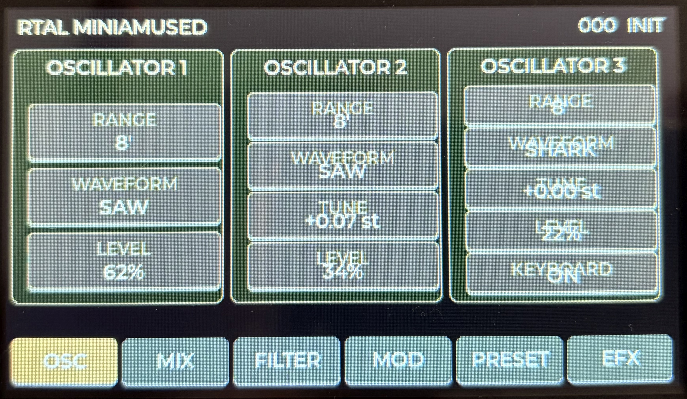

# RTAL MiniAmused

### A playable virtual-analog synthesizer, built on the ESP32-S3

**MONO / DUAL SYNTHESIS · 3 OSCILLATORS PER VOICE · 4-POLE LADDER FILTER · MARKOV ARPEGGIATOR · STEREO PING-PONG DELAY**


**RTAL-EAI-011 · RealTimeAudioLab · v1.2.6 FINAL**



*An independent hardware instrument inspired by the immediacy of classic subtractive synthesis — with modern embedded DSP, expressive performance controls and a graphical touch interface.*

</div>

---

## 🎬 MiniAmused in action — live sound demo

Hear and see the actual instrument. The MP4 includes audio and plays directly in GitHub's README viewer.

https://github.com/user-attachments/assets/30ecef16-6080-4b98-9c3e-df4c5270c23e


---

## The instrument at a glance

**MiniAmused is a complete standalone synthesizer, not just a waveform generator or an ESP32 demonstration.** A single ESP32-S3 handles audio synthesis, nonlinear filtering, MIDI, a graphical touchscreen, SD-card presets, stereo effects and a dedicated real-time arpeggiator.

| Sound engine | Performance & control | Hardware & workflow |
|:--|:--|:--|
| **MONO / DUAL** — up to two simultaneous notes | **Markov Chain Arpeggiator** plus four classic modes | **4.3-inch** capacitive touchscreen |
| **Three oscillators per voice** + noise | Swing, ratchet, density, accent, mutation and hold | **Seven** dedicated control pages |
| **Six waveforms**, tuning and octave ranges | Internal tempo or external MIDI Clock | **DIN MIDI + native USB MIDI** |
| Nonlinear **4-pole ladder-style filter** | Glide, note priority and trigger modes | **128 microSD presets**, Program Change |
| Separate filter and loudness ADSR | MIDI Learn and CC32 controller banks | SD fault messages and reliable touch controls |
| **Stereo delay** with five ping-pong modes | Clock-synchronized echoes | **48 kHz / 128-frame** audio blocks |

> **The design principle:** retain the clarity and playability of a classic analog instrument while using digital technology where it adds genuine musical possibilities.

## 01 · Sound design — three oscillators, two playing modes

Each MiniAmused voice contains **OSC 1, OSC 2 and OSC 3**, with independent oscillator phases and pitch state. Choose between:

- **MONO** — one three-oscillator voice for classic basses, leads, legato playing and expressive glide.
- **DUAL** — two simultaneously sounding three-oscillator voices for intervals, two-note chords and layered performances. The oldest voice is replaced when a third note needs a voice.

The voices share the downstream **mixer, four-stage filter, filter/loudness envelope processing and stereo delay**. DUAL is therefore two-note polyphony, **not** two completely independent filter-and-envelope signal paths.

```text
     MIDI / USB MIDI / ARPEGGIATOR
                  │
            NOTE ALLOCATION
                  │
       ┌──────────┴──────────┐
       ▼                     ▼
  VOICE 1                 VOICE 2       [DUAL mode]
  OSC 1 / 2 / 3           OSC 1 / 2 / 3
       └──────────┬──────────┘
                  ▼
            MIXER + NOISE
                  ▼
            DRIVE / FEEDBACK
                  ▼
        4-POLE LADDER FILTER ◄── FILTER ADSR / MODULATION
                  ▼
         LOUDNESS ENVELOPE
                  ▼
          STEREO DELAY
                  ▼
           I2S AUDIO OUT
```

### Oscillator palette

| Waveform | Sound character |
|:--|:--|
| **TRI** | Soft, rounded fundamental tones |
| **SHARK** | A characterful transition between triangle and brighter shapes |
| **SAW** | Rich harmonics for resonant leads, basses and sweeps |
| **SAW/SQ** | Hybrid saw/square character |
| **SQUARE** | Hollow, focused tone |
| **PULSE** | Nasal and cutting; useful in layered patches |

Each oscillator offers **32′ / 16′ / 8′ / 4′ / 2′** ranges. OSC 2 and OSC 3 provide tuning control; OSC 3 can be disconnected from keyboard tracking for modulation duties. The mixer adds noise, individual oscillator levels, drive and internal feedback.

<table>
<tr>
<td width="50%"><br><sub><b>OSC</b> — waveform, range and oscillator tuning</sub></td>
<td width="50%"><br><sub><b>MIX</b> — oscillator balance, noise, drive and feedback</sub></td>
</tr>
</table>

## 02 · The filter — the center of the sound

MiniAmused uses an original **four-stage nonlinear ladder-inspired low-pass filter** with global resonance feedback. The mixer/filter path operates with **2× oversampling** to retain character under stronger drive and resonance.

- **CUTOFF** sets the filter frequency; **EMPHASIS** shapes resonance.
- **Resonance-dependent bass compensation** preserves more low-frequency body as resonance increases.
- **KEY TRACK** offers OFF, 1/3, 2/3 and FULL tracking.
- A dedicated **Filter ADSR** controls the changing cutoff, independently of the **Loudness ADSR**.
- The modulation bus blends **OSC 3 and noise** and can be routed to pitch and filter cutoff, with MOD WHEEL intensity control.

**Keyboard performance** includes LOW / LAST / HIGH note priority, SINGLE / MULTI envelope triggering and adjustable glide. The result ranges from soft, rounded patches to biting, resonant leads and animated sequences.

<table>
<tr>
<td width="50%"><br><sub><b>FILTER</b> — cutoff, resonance, key tracking and contour</sub></td>
<td width="50%"><br><sub><b>MOD</b> — modulation, envelopes, performance and voice mode</sub></td>
</tr>
</table>

## 03 · Stereo delay — five distinct ping-pong characters

The EFX page contains a purpose-built **stereo delay**, rather than a generic multi-effect collection. It features delay time, feedback, low-pass filtering in the repeat path, dry/wet mix, stereo shaping and rhythmic synchronization.

| Ping-pong mode | What you hear |
|:--|:--|
| **LEGACY** | The original crossed-feedback stereo character |
| **CLASSIC** | Clear alternating **left → right → left** repeats |
| **SOFT** | Gentle stereo motion with restrained cross-feedback |
| **WIDE** | A more expansive stereo pattern with cross-channel interaction |
| **DUAL** | Two mostly independent left/right delay lines with subtle coupling |

**PING AMT** adjusts the mode-dependent interaction of the left and right paths (LEGACY retains its own fixed behavior). **WIDTH** changes the relative L/R delay-tap timing, whereas **ST WIDTH** adjusts the width of the resulting stereo output. They are different controls with complementary results.

With **SYNC ON**, MIDI Clock supplies musical divisions, including straight, dotted and triplet values. Changes between delay taps are crossfaded to reduce abrupt timing artifacts.


*EFX — independent delay timing, feedback, filtering, width, five ping-pong modes and MIDI synchronization.*

## 04 · Markov Chain Arpeggiator — controlled musical variation

The dedicated arpeggiator is a central part of MiniAmused's playing experience. It holds a pool of incoming MIDI notes and transforms them into a timed sequence. Select **UP, DOWN, UP-DOWN, RANDOM or MARKOV**.

**MARKOV** does not pick every note independently at random: the current note position influences the probability of the next move. The result can repeat recognizable shapes while introducing controlled variation.

| Control | Musical effect |
|:--|:--|
| **RATE / GATE** | Sequence speed and note duration |
| **OCTAVES** | Expand notes across registers |
| **MARKOV / MUTATION / RANGE** | Balance regular movement, surprise and melodic reach |
| **HOLD** | Latch a note pool without holding the keyboard |
| **DENSITY** | Create intentional rhythmic gaps |
| **SWING** | Add rhythmic push and pull |
| **RATCHET** | Retrigger notes within a step |
| **ACCENT / ACCENT MODE** | Shape dynamic emphasis with several accent patterns |
| **REPEAT** | Reuse earlier positions for more coherent phrases |
| **MIDI SYNC / TEMPO** | Follow MIDI Clock or use an internal clock (40–300 BPM) |

The arpeggiator runs independently of the graphical refresh. **MIDI Clock (F8) and transport events (FA/FB/FC)** are handled separately for reliable synchronization.


*ARP — classic note patterns or probabilistic Markov movement, with live rhythm and performance controls.*

## 05 · A dedicated touchscreen front panel

MiniAmused uses the **Guition JC4827W543** with **480 × 272 pixels**, **GT911 capacitive touch** and **LVGL 8.4.0**. Instead of deeply nested menus, seven persistent pages follow the instrument's signal path:

<div align="center">

`OSC` &nbsp; → &nbsp; `MIX` &nbsp; → &nbsp; `FILTER` &nbsp; → &nbsp; `MOD` &nbsp; → &nbsp; `EFX` &nbsp; → &nbsp; `ARP` &nbsp; → &nbsp; `PRESET`

</div>

Touch overlays make parameters legible while leaving the main layout familiar. **Discrete ON/OFF controls have 180 ms touch debounce** to reject unintended double triggers without delaying continuous sliders or incoming MIDI control. The QSPI display pipeline is optimized for responsive operation alongside real-time audio.

## 06 · Presets — 128 sounds, ready to recall

Presets live on a microSD card in **slots 000–127**. The PRESET page provides **LOAD, SAVE, SAVE AS, INIT and DELETE**. Incoming MIDI **Program Change 0–127** can recall the corresponding preset.

**Preset navigation is touch-safe:** a short UP or DOWN tap moves by **exactly one slot**; holding a direction begins automatic scrolling after approximately **500 ms** and accelerates for faster browsing. Simply moving between slots does not load every sound automatically.

```text
/RTAL_MINIAMUSED/
└── presets/
    ├── 000.rtal
    ├── 001.rtal
    ├── 002.rtal
    └── ... 127.rtal
```

**Clear status instead of silent errors:** a missing card reports `SD CARD NOT FOUND`, a preset-folder problem reports `SD PRESET DIR ERROR`, and an unoccupied slot is differentiated from an inaccessible SD card. Synthesis and MIDI continue to operate even if card initialization fails; loading and saving require working storage.


*PRESET — numbered slots, names, straightforward file actions and dependable UP/DOWN navigation.*

## 07 · MIDI that fits a real studio

MiniAmused receives **DIN MIDI and native USB MIDI**. It supports OMNI or MIDI channels 1–16, notes, pitch bend, standard modulation controllers and MIDI Clock. Its **MIDI Learn / mapping** system enables external controllers to reach far beyond what fits on the touchscreen.

A **CC32 bank-selection system** is available for compatible controller workflows:

| CC32 bank | Controls |
|:--|:--|
| **0 — SYNTH** | Sound-design parameters; **CC102** is filter cutoff in this bank |
| **1 — EFX** | Delay enable, time, feedback, mix, filter, width, ping-pong and sync |
| **2 — ARP** | Mode, rate, gate, octaves, Markov, mutation, range, hold, density, swing, ratchet, accent and clock |

Both the delay and the arpeggiator can follow incoming MIDI Clock; the arpeggiator also offers its own internal tempo. The MOD page contains **VOICE MODE (MONO/DUAL)** for selecting the playing architecture.

## 08 · Built on compact, accessible hardware

<table>
<tr>
<td width="50%"><br><sub>Guition JC4827W543 — front</sub></td>
<td width="50%"><br><sub>Guition JC4827W543 — rear</sub></td>
</tr>
</table>

| Subsystem | MiniAmused v1.2.6 FINAL |
|:--|:--|
| Controller | ESP32-S3, dual-core Xtensa LX7, up to 240 MHz |
| Display | 4.3-inch TFT, 480 × 272, QSPI |
| Touch | GT911 capacitive controller |
| GUI | LVGL 8.4.0 |
| Audio synthesis | 48,000 samples/s · 128 frames/block |
| Audio output | External I2S stereo DAC, e.g. PCM5102A |
| Audio pins | BCLK GPIO16 · LRCK GPIO15 · DATA GPIO7 |
| MIDI | DIN MIDI + native USB MIDI |
| MIDI serial pins | RX GPIO18 · TX GPIO17 |
| Presets | microSD · 128 slots |
| Display optimization | QSPI at 32 MHz, partial-buffer rendering |

### Real-time architecture

Audio processing is organized separately from MIDI, arpeggiation, touch, display and storage. The **audio task** has its own timing budget; GUI rendering and SD access must not interrupt audio generation. At **48 kHz with 128-frame blocks**, the available audio-block interval is approximately **2.67 ms**.

This compact platform demonstrates how far careful task separation and DSP design can take a small embedded synthesizer.

## 09 · Get started

1. Assemble the **Guition JC4827W543**, external I2S DAC, MIDI input/output and microSD wiring for the MiniAmused hardware configuration.
2. Install **Arduino IDE 2.x**, the **Arduino-ESP32 3.x** board package and the project dependencies (including **LVGL 8.4.0** and **Arduino_GFX**).
3. Open the Arduino sketch from the release folder: `RTAL_MINIAMUSED_1_2_6_FINAL/RTAL_MINIAMUSED_1_2_6_FINAL.ino`. Keep the directory and `.ino` filename identical.
4. Flash the ESP32-S3, connect the audio output and a MIDI keyboard, and wait for the MiniAmused UI.
5. Start on **OSC**, open **FILTER**, then explore **ARP**, **EFX** and **PRESET**. Add a microSD card before saving or loading sounds.

**Repository resources:** [Firmware](firmware/) · [Documentation](docs/) · [SD-card content](sdcard_content/) · [Images](images/)

The full German user/reference manual provides detailed control descriptions, CC mappings, preset procedures, delay modes and troubleshooting.

## 10 · An instrument, not a clone

MiniAmused draws inspiration from the **musical immediacy and subtractive signal flow of classic synthesizers**, especially the Minimoog. It is **not** a circuit-accurate reproduction, and it is not affiliated with Moog Music. Its own identity comes from the combination of dual-note operation, a nonlinear embedded filter, integrated stereo delay, touch workflow and a probabilistic performance engine.

**Acknowledgements:** Bob Moog and the designers of classic synthesizers; Espressif Systems; Guition; the LVGL, Arduino and open-source audio communities.

---

### RTAL MiniAmused · v1.2.6 FINAL

**Three oscillators. A resonant ladder. Two voices. Endless musical directions.**

*RealTimeAudioLab · RTAL Embedded Audio Initiative · RTAL-EAI-011*

[Explore RealTimeAudioLab](https://github.com/RealTimeAudioLab) · [Project repository](https://github.com/RealTimeAudioLab/RTAL-EAI-011-MiniAmused-Synthesizer)

</div>
